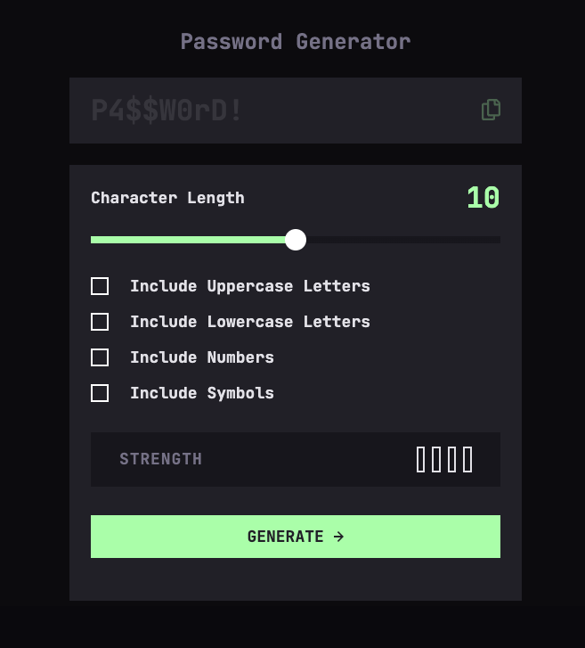
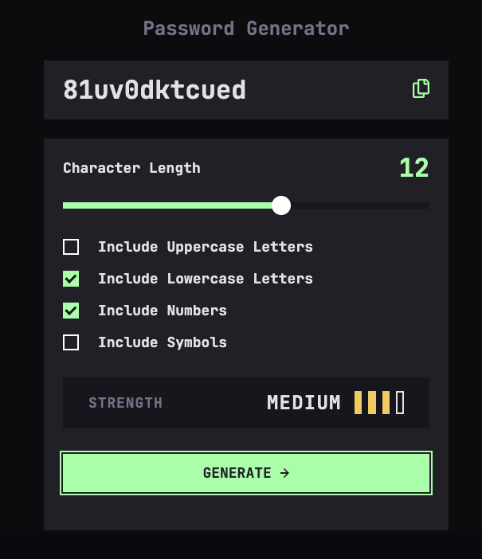
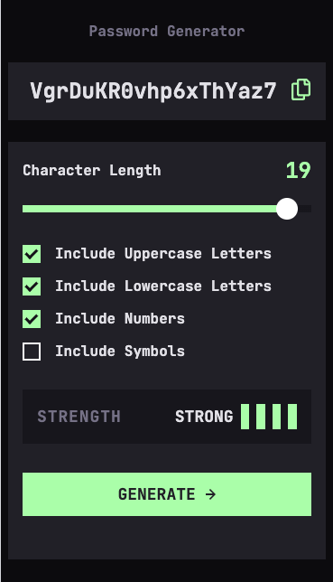

# Frontend Mentor - Password generator app solution

This is a solution to the [Password generator app challenge on Frontend Mentor](https://www.frontendmentor.io/challenges/password-generator-app-Mr8CLycqjh). Frontend Mentor challenges help you improve your coding skills by building realistic projects. 

## Table of contents

- [Overview](#overview)
  - [The challenge](#the-challenge)
  - [Screenshot](#screenshot)
  - [Links](#links)
- [My process](#my-process)
  - [Built with](#built-with)
  - [What I learned](#what-i-learned)
  - [Continued development](#continued-development)
  - [AI Collaboration](#ai-collaboration)
- [Author](#author)

**Note: Delete this note and update the table of contents based on what sections you keep.**

## Overview

### The challenge

Users should be able to:

- Generate a password based on the selected inclusion options
- Copy the generated password to the computer's clipboard
- See a strength rating for their generated password
- View the optimal layout for the interface depending on their device's screen size
- See hover and focus states for all interactive elements on the page

### Screenshot

### Links

- Solution URL: [Add solution URL here](https://github.com/majdal01/password_generator_app.git)
- Live Site URL: [Add live site URL here](https://majdal01.github.io/password_generator_app/)

## My process

### Built with

- Sass
- [Vue](https://vuejs.org/) - Vue framework

### What I learned

Trying to learn Vue.js, så this was a great opportunity to give it a shot. And therefore - learned a lot about how to structure my code, and how to split up in components, although not quite sure, if the split makes sense.

### Continued development

Everything - especially JavaScript

### AI Collaboration

I use both copilot and ChatGPT for giving me hints to solutions, improvements og help me debug. 
So I use them as my teacher. 
Sometimes the help copilot gives will just wonder off and make everything worse. That´s when I go to chatGPT, and it has never failed me. 

## Author

- Frontend Mentor - [@yourusername](https://www.frontendmentor.io/profile/majdal01)

